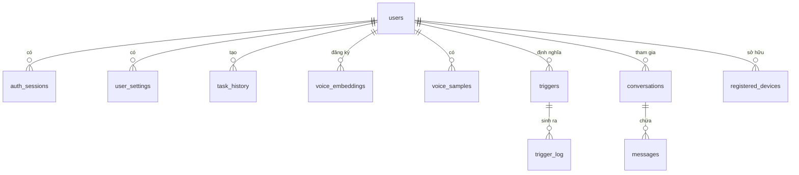

# Mô Hình Dữ Liệu

## Mục đích

Tài liệu này mô tả toàn bộ schema SQLite của OmniState Gateway, bao gồm các bảng, cột, index, quan hệ, cũng như các cấu trúc dữ liệu JSON dạng nhúng (in-column) cho state-graph, plugin manifest, và trigger config.

---

## Vị trí Database

```
~/.omnistate/omnistate.db   ← file SQLite chính
```

**Pragma được áp dụng khi khởi động:**

| Pragma | Giá trị | Lý do |
|--------|---------|-------|
| `journal_mode` | WAL | Đọc/ghi song song, hiệu suất tốt hơn DELETE mode |
| `foreign_keys` | ON | Bảo toàn toàn vẹn quan hệ |
| `busy_timeout` | 5000 ms | Tự retry khi DB bị lock tạm thời |

---

## ERD Tổng Quan



---

## Bảng Chi Tiết

### `users` — Tài khoản người dùng

| Cột | Kiểu | Ràng buộc | Mô tả |
|-----|------|-----------|-------|
| `id` | TEXT | PK | UUID v4 |
| `email` | TEXT | NOT NULL, UNIQUE | Email đăng nhập |
| `password_hash` | TEXT | NOT NULL | bcrypt hash |
| `display_name` | TEXT | DEFAULT '' | Tên hiển thị |
| `preferred_language` | TEXT | DEFAULT 'en' | Mã ngôn ngữ BCP-47 |
| `is_active` | INTEGER | DEFAULT 1 | 1 = hoạt động |
| `created_at` | TEXT | DEFAULT now | ISO 8601 UTC |
| `updated_at` | TEXT | DEFAULT now | ISO 8601 UTC |

**Index:** `idx_users_email` trên `(email)`

---

### `auth_sessions` — Phiên xác thực

| Cột | Kiểu | Mô tả |
|-----|------|-------|
| `id` | TEXT PK | UUID |
| `user_id` | TEXT FK → users | Cascade delete |
| `refresh_token` | TEXT UNIQUE | Token làm mới JWT |
| `expires_at` | TEXT | Thời điểm hết hạn |
| `user_agent` | TEXT | UA của client |
| `ip_address` | TEXT | IP kết nối |
| `created_at` | TEXT | Thời điểm tạo |
| `last_active_at` | TEXT | Lần hoạt động cuối |

**Index:** `idx_auth_sessions_user (user_id)`, `idx_auth_sessions_refresh (refresh_token)`

---

### `user_settings` — Cài đặt người dùng (key-value)

| Cột | Kiểu | Mô tả |
|-----|------|-------|
| `user_id` | TEXT FK | PK composite |
| `key` | TEXT | Tên cài đặt |
| `value` | TEXT | Giá trị (JSON string) |

**PK:** `(user_id, key)`

---

### `task_history` — Lịch sử tác vụ

| Cột | Kiểu | Mô tả |
|-----|------|-------|
| `id` | TEXT PK | UUID |
| `user_id` | TEXT FK → users | SET NULL khi xóa user |
| `goal` | TEXT | Câu lệnh gốc của người dùng |
| `status` | TEXT | `pending` \| `running` \| `complete` \| `failed` |
| `output` | TEXT | Kết quả trả về (text hoặc JSON) |
| `intent_type` | TEXT | Phân loại intent |
| `duration_ms` | INTEGER | Thời gian thực thi |
| `resource_impact_json` | TEXT | JSON: CPU%, mem MB tiêu thụ |
| `created_at` | TEXT | Thời điểm tạo |
| `completed_at` | TEXT | Thời điểm hoàn thành |

**Index:** `idx_task_history_user (user_id, created_at DESC)`

---

### `voice_embeddings` — Vân giọng người dùng

| Cột | Kiểu | Mô tả |
|-----|------|-------|
| `id` | TEXT PK | UUID |
| `user_id` | TEXT FK UNIQUE | Mỗi user 1 embedding |
| `embedding_json` | TEXT | Vector float[] (JSON) |
| `sample_count` | INTEGER | Số mẫu giọng đã dùng |
| `threshold` | REAL | Ngưỡng cosine similarity (default 0.85) |
| `model_version` | TEXT | `resemblyzer-v1` |
| `enrolled_at` | TEXT | Lần đăng ký đầu |
| `updated_at` | TEXT | Lần cập nhật cuối |

---

### `voice_samples` — Mẫu audio thô

| Cột | Kiểu | Mô tả |
|-----|------|-------|
| `id` | TEXT PK | UUID |
| `user_id` | TEXT FK | Cascade delete |
| `audio_hash` | TEXT | SHA-256 của audio |
| `duration_ms` | INTEGER | Độ dài mẫu |
| `prompt_text` | TEXT | Văn bản đọc mẫu |
| `created_at` | TEXT | Thời điểm thu |

---

### `triggers` — Kích hoạt tự động

| Cột | Kiểu | Mô tả |
|-----|------|-------|
| `id` | TEXT PK | UUID |
| `user_id` | TEXT FK | Cascade delete |
| `name` | TEXT | Tên trigger |
| `description` | TEXT | Mô tả |
| `condition_json` | TEXT | Xem mục *Trigger condition schema* |
| `action_json` | TEXT | Xem mục *Trigger action schema* |
| `enabled` | INTEGER | 1 = bật |
| `cooldown_ms` | INTEGER | Khoảng cách tối thiểu giữa 2 lần fire |
| `fire_count` | INTEGER | Tổng số lần đã fire |
| `last_fired_at` | TEXT | Thời điểm fire gần nhất |

**Index:** `idx_triggers_enabled (user_id, enabled)`

---

### `trigger_log` — Nhật ký fire trigger

| Cột | Kiểu | Mô tả |
|-----|------|-------|
| `id` | TEXT PK | UUID |
| `trigger_id` | TEXT FK | Cascade delete |
| `user_id` | TEXT FK | Denorm để query nhanh |
| `fired_at` | TEXT | Thời điểm kích hoạt |
| `condition_snapshot` | TEXT | JSON snapshot điều kiện lúc fire |
| `task_id` | TEXT | task_history.id được tạo ra |
| `status` | TEXT | `fired` \| `executed` \| `failed` \| `skipped` |
| `error` | TEXT | Thông báo lỗi nếu có |

---

### `conversations` + `messages` — Lịch sử chat

**`conversations`**

| Cột | Mô tả |
|-----|-------|
| `id` TEXT PK | UUID |
| `user_id` FK | Cascade delete |
| `name` | Tiêu đề cuộc hội thoại |
| `created_at`, `updated_at` | Timestamp |

**`messages`**

| Cột | Mô tả |
|-----|-------|
| `id` TEXT PK | UUID |
| `conversation_id` FK | Cascade delete |
| `role` | `user` \| `assistant` \| `system` |
| `content` | Nội dung văn bản |
| `task_id` | Liên kết task_history nếu có |
| `data_json` | Metadata bổ sung |
| `created_at` | Timestamp |

---

### `registered_devices` — Thiết bị điều khiển từ xa

| Cột | Kiểu | Mô tả |
|-----|------|-------|
| `id` | TEXT PK | UUID |
| `device_name` | TEXT | Tên thiết bị |
| `device_type` | TEXT | `android` \| `ios` \| `cli` |
| `device_token` | TEXT UNIQUE | JWT 30 ngày |
| `refresh_token` | TEXT UNIQUE | JWT 90 ngày |
| `user_id` | TEXT | Nullable, user sở hữu |
| `paired_via` | TEXT | `lan_pin` \| `tailscale` |
| `tailscale_ip` | TEXT | IP Tailscale nếu có |
| `last_seen_at` | TEXT | Lần kết nối cuối |
| `last_seen_ip` | TEXT | IP cuối |
| `is_revoked` | INTEGER | 1 = đã thu hồi |

---

## Cấu Trúc JSON Nhúng

### Trigger Condition Schema

```json
{
  "type": "schedule" | "event" | "voice" | "system",
  "cron": "0 9 * * 1-5",          // nếu type=schedule
  "event": "focus.changed",        // nếu type=event
  "threshold": { "cpu": 90 }       // nếu type=system
}
```

### Trigger Action Schema

```json
{
  "type": "task",
  "goal": "Tóm tắt email chưa đọc",
  "layer": "deep" | "surface" | "auto"
}
```

### Resource Impact Schema (`resource_impact_json`)

```json
{
  "cpuPercent": 12.5,
  "memMb": 48,
  "diskReadMb": 0,
  "networkKb": 120
}
```

---

## Migration Versioning

Bảng `migrations` theo dõi phiên bản schema:

| Cột | Mô tả |
|-----|-------|
| `version` INTEGER PK | Số thứ tự migration |
| `name` TEXT | Tên mô tả |
| `applied_at` TEXT | Thời điểm áp dụng |

Hiện tại có **6 migrations** (v1–v6). Migration chạy tự động khi gateway khởi động; transaction-safe.

---

## Tham chiếu

- [Gateway Lõi](02-GATEWAY-LOI.md) — kiến trúc tổng thể daemon
- [Mô Hình Bảo Mật](10-MO-HINH-BAO-MAT.md) — JWT, session security
- [Hợp Đồng API](16-HOP-DONG-API.md) — REST/WS endpoints dùng các bảng này
- Source: `packages/gateway/src/db/database.ts`
