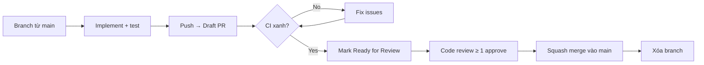

# Hướng Dẫn Đóng Góp

## Mục đích

Tài liệu này giúp contributor mới thiết lập môi trường, hiểu quy trình làm việc, và đảm bảo mọi thay đổi đều đi qua cùng một tiêu chuẩn chất lượng.

---

## Yêu Cầu Công Cụ

| Công cụ | Phiên bản | Ghi chú |
|---------|-----------|---------|
| Node.js | 22.x | LTS; dùng `.nvmrc` hoặc `volta` |
| pnpm | 10.x | `npm i -g pnpm@10` |
| Rust | 1.80+ (stable) | `rustup update stable` |
| Xcode | 15+ (macOS) | Cần Xcode CLI Tools cho native bindings |
| Git | 2.40+ | — |

**macOS chỉ:**
```bash
# Cài Xcode CLI Tools
xcode-select --install

# Cài Rust
curl --proto '=https' --tlsv1.2 -sSf https://sh.rustup.rs | sh
```

---

## Thiết Lập Dev Nhanh

```bash
git clone https://github.com/<org>/omnistate.git
cd omnistate
pnpm install           # Cài JS dependencies
cargo build            # Build Rust crates
pnpm build             # Build TS packages
pnpm dev               # Khởi động gateway + web (hot-reload)
```

Lần đầu chạy, gateway sẽ bật wizard config. Xem [Runbook](17-RUNBOOK.md#cài-đặt-lần-đầu).

---

## Cấu Trúc Monorepo

```
omnistate/
├── crates/                  # Rust native (6 crates)
├── packages/
│   ├── gateway/             # Node.js daemon — lõi hệ thống
│   ├── web/                 # Vite SPA dashboard
│   ├── shared/              # Types dùng chung (TS)
│   ├── mobile-core/         # Cross-platform mobile logic
│   └── cli/                 # CLI client
├── apps/
│   ├── macos/               # Swift app
│   └── android/             # React Native
└── docs/vi/                 # Tài liệu tiếng Việt
```

---

## Quy Tắc Branch

```
feat/<tên-ngắn>       → tính năng mới
fix/<tên-ngắn>        → sửa bug
chore/<tên-ngắn>      → tooling, deps, config
refactor/<tên-ngắn>   → refactor không thêm tính năng
docs/<tên-ngắn>       → chỉ cập nhật tài liệu
```

Branch từ `main`. Merge trong **1–3 ngày** — tránh branch tồn tại lâu.

---

## Commit Convention

Dùng [Conventional Commits](https://www.conventionalcommits.org/):

```
<type>(<scope>): <mô tả ngắn>

<body giải thích WHY — không bắt buộc nhưng khuyến khích>
```

| Type | Khi nào dùng |
|------|-------------|
| `feat` | Tính năng mới |
| `fix` | Sửa bug |
| `refactor` | Thay đổi code không ảnh hưởng behavior |
| `test` | Thêm/sửa test |
| `docs` | Chỉ tài liệu |
| `chore` | Deps, config, tooling |
| `perf` | Tối ưu hiệu suất |

**Ví dụ tốt:**
```
feat(gateway): thêm rate limiting cho voice endpoints

Giới hạn 30 req/15 phút để tránh abuse STT API.
Dùng sliding window counter tương tự auth endpoints.
```

**Atomic:** 1 commit = 1 thay đổi logic. Không trộn refactor + feature.

---

## Quy Trình Pull Request



**Checklist trước khi tạo PR:**
- [ ] `pnpm lint` pass
- [ ] `pnpm typecheck` pass
- [ ] `pnpm test` pass (không có test mới fail)
- [ ] Không có secret trong diff: `git diff --cached | grep -i "password\|api_key\|token"`
- [ ] Mô tả PR giải thích WHY, không chỉ WHAT
- [ ] Các file doc liên quan được cập nhật nếu cần

**Squash merge** về `main` để giữ history sạch. Tiêu đề squash commit = tiêu đề PR theo Conventional Commits.

---

## Code Style

### TypeScript / JavaScript

- **Formatter:** Prettier (chạy tự động qua lint-staged)
- **Linter:** ESLint với config dự án
- **Tabs vs Spaces:** Theo `.editorconfig` (2 spaces)

```bash
# Fix tự động
pnpm lint --fix

# Kiểm tra format
pnpm format:check
```

### Rust

```bash
# Format
cargo fmt --all

# Lint (warnings = errors trong CI)
cargo clippy --workspace -- -D warnings
```

### Swift

- SwiftFormat + SwiftLint (nếu cài)
- Style theo `.swiftlint.yml` trong `apps/macos/`

---

## Viết Test

- Mọi bug fix phải có test tái hiện bug trước khi sửa (TDD for bugs)
- Mọi tính năng mới phải có unit test hoặc integration test
- Không giảm coverage dưới ngưỡng mục tiêu (xem [Chiến Lược Kiểm Thử](18-CHIEN-LUOC-KIEM-THU.md))

---

## Tài Liệu

Khi thêm tính năng mới:
- Cập nhật `docs/vi/` nếu thay đổi ảnh hưởng kiến trúc hoặc API
- Cập nhật `docs/STATUS.md` nếu hoàn thành use case / milestone
- Thêm ADR vào `docs/vi/20-NHAT-KY-QUYET-DINH/` nếu có quyết định kỹ thuật đáng ghi

---

## Báo Lỗi & Feature Request

- Dùng GitHub Issues
- Bug report: mô tả bước tái hiện, log liên quan, OS/Node version
- Feature request: giải thích use case, không chỉ giải pháp

---

## Tham chiếu

- [Runbook Vận Hành](17-RUNBOOK.md) — thiết lập môi trường
- [Chiến Lược Kiểm Thử](18-CHIEN-LUOC-KIEM-THU.md) — yêu cầu test
- [Nhật Ký Quyết Định](20-NHAT-KY-QUYET-DINH/README.md) — ADR
